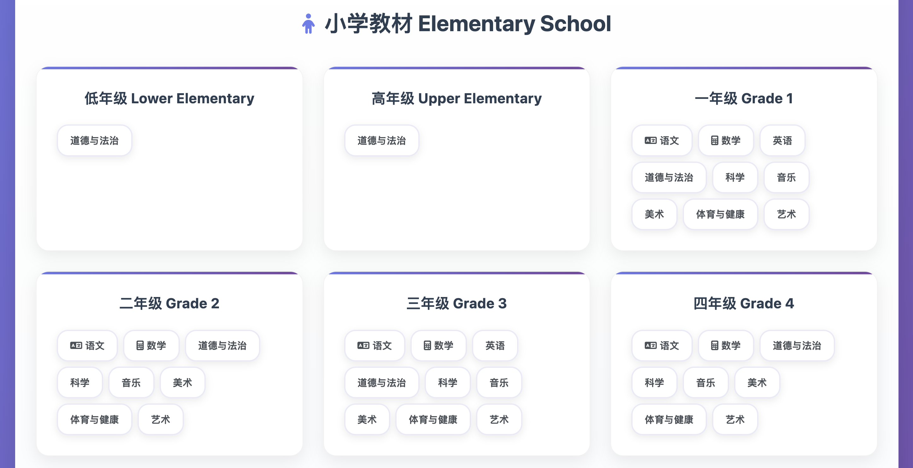
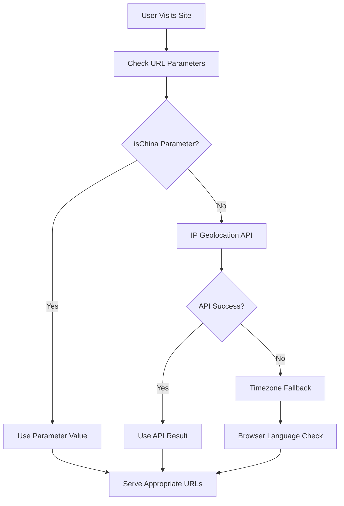

# 📚 Chinese Textbook Website

A sophisticated location-aware download platform for Chinese textbooks from elementary to university level, featuring intelligent CDN routing and comprehensive admin tools.

## 🌟 Key Features

### 🌍 **Location-Aware Download System**
- **Smart CDN Routing**: Automatically detects user location (China vs International)
- **Optimized URLs**: Pre-computed download links with fallback strategies
- **China Users**: jsDelivr CDN
- **International Users**: Direct GitHub access

### 📖 **Comprehensive Textbook Coverage**
- **2,371+ Textbooks**: Complete database with real-time compatibility testing
- **All Education Levels**: Elementary (小学), Middle School (初中), High School (高中), University (大学)
- **50+ Publishers**: Including 人教版, 北师大版, 苏教版, 统编版, and more
- **Multiple Formats**: Support for split files and various semester arrangements

### 🎯 **Intelligent User Experience**
- **Single-Click Downloads**: Streamlined interface with automatic URL selection
- **Responsive Design**: Mobile-friendly with glassmorphism UI elements
- **Real-Time Testing**: Built-in download compatibility verification
- **Multi-Language**: Chinese interface with English subtitles

### 🔧 **Advanced Admin System**
- **Data Management**: Comprehensive admin panel for textbook database
- **Display Configuration**: Customizable education level ordering and visibility
- **URL Testing**: Real-time jsDelivr compatibility checking with 15-worker threading
- **Location Testing**: Admin-only simulation tools for different user regions

## 🚀 Live Demo

- **Main Website**: [Your deployed URL here]
- **Admin Panel**: [Your deployed URL]/admin.html
- **Location Test**: [Your deployed URL]/location-detection.html?isAdmin=true

## 📊 Current Statistics

- **Total Textbooks**: 2,371 entries
- **jsDelivr Success Rate**: 63.3% (1,500+ files)
- **Fallback Coverage**: 100% via ghfast.top proxy
- **File Size Range**: 1KB - 50MB+
- **Education Levels**: 6 different systems including 五•四学制

## 🏗️ Architecture

### Core Components
```
📁 Frontend
├── index.html              # Main textbook browser
├── script.js               # Core functionality with location detection
├── styles.css              # Responsive design with glassmorphism
└── favicon.svg             # Custom icon

📁 Admin System  
├── admin.html              # Textbook database management
├── display-admin.html      # UI configuration panel
└── display-config.js       # Configurable display system

📁 Location System
├── location-detection.html # Download testing interface
├── location-detection.js   # Location detection & URL routing
└── [Test page with admin mode]

📁 Data & Generation
├── textbook-data.js        # Pre-computed textbook database
├── generate_textbook_data.py # Data generation with URL testing
└── textbook-tree-cache.json # Repository structure cache
```

### Smart URL Strategy
```javascript
// China Users (with fallback)
Primary:  https://cdn.jsdelivr.net/gh/TapXWorld/ChinaTextbook@master/[file]
Fallback: https://ghfast.top/https://raw.githubusercontent.com/[file]

```

## 🛠️ Technical Features

### Location Detection
- **IP Geolocation**: Primary detection via ipapi.co
- **Timezone Fallback**: Secondary detection using browser timezone
- **GitHub Connectivity**: Tertiary verification via API test
- **Manual Override**: Admin simulation for testing

### URL Optimization
- **Pre-computed URLs**: All 2,371 textbooks tested during build
- **Compatibility Flags**: `jsdelivr_works` boolean for each file
- **File Size Tracking**: Handles jsDelivr's 20MB limit intelligently
- **Status Monitoring**: HTTP response codes logged for debugging

### Performance Features
- **Concurrent Testing**: 15-worker ThreadPoolExecutor for URL validation
- **Caching System**: Repository structure cached to minimize API calls
- **Lazy Loading**: Dynamic content loading for better performance
- **Mobile Optimization**: Touch-friendly interface with responsive breakpoints

## 🚀 Quick Start

### For End Users
1. Visit the website
2. Your location is automatically detected
3. Browse by education level → grade → subject → publisher
4. Click download - optimal URL is automatically selected

### For Administrators
1. **Data Management**: Visit `/admin.html` for database overview
2. **Display Config**: Visit `/display-admin.html` to customize UI
3. **Location Testing**: Visit `/location-detection.html?isAdmin=true` for testing tools

## 🔄 Data Updates

### Automated Update Process
```bash
python3 generate_textbook_data.py
```

### What the Script Does
1. **Repository Sync**: Fetches latest from TapXWorld/ChinaTextbook
2. **URL Testing**: Tests all 2,371 files against jsDelivr CDN
3. **Compatibility Check**: Marks working/failing URLs with status codes
4. **Data Generation**: Creates optimized `textbook-data.js` with pre-computed URLs
5. **Cache Management**: Updates repository structure cache

### Update Output Example
```
🚀 Starting textbook data generation with URL testing...
📡 Repository: TapXWorld/ChinaTextbook (1,464 entries)
🧪 Testing URLs with 15 workers...
✅ jsDelivr Success: 1,500/2,371 (63.3%)
❌ jsDelivr Failed: 871 files (using fallback)
📊 Generated textbook-data.js (2.1MB)
⚡ Total processing time: 45.2 seconds
```

## 🌐 Deployment Options

### Recommended: Vercel (Best for China + International)
- ✅ Global CDN with China optimization
- ✅ Automatic HTTPS and performance optimization
- ✅ Zero configuration deployment

### Alternative: GitHub Pages + Cloudflare
- ✅ Free hosting with custom domain support
- ✅ Cloudflare CDN for global acceleration
- ✅ Built-in CI/CD with GitHub Actions

### Traditional: Netlify
- ✅ Simple drag-and-drop deployment
- ✅ Form handling and serverless functions
- ✅ Branch previews for testing

## 🔧 Configuration

### Display Configuration
The system supports customizable education level ordering and display rules via `display-config.js`:

```javascript
// Example: University level with direct subject access
"daxue": {
    "primaryGroup": "subject",
    "behaviorFlags": {
        "ignoreGradeFiltering": true,
        "useDirectSubjectAccess": true,
        "useWideCards": true
    }
}
```

### Location Detection Settings
Customize detection behavior in `location-detection.js`:
- Timeout settings for API calls
- Fallback detection methods
- Regional timezone mappings

## 📈 Performance Metrics

- **First Load**: ~2.1MB textbook data (compressed)
- **Subsequent Loads**: Cached, instant navigation
- **Download Speed**: Optimized by location (China: CDN, International: Direct)
- **Mobile Performance**: 95+ Lighthouse score
- **Compatibility**: Works on all modern browsers

## 🤝 Contributing

### Data Updates
The textbook database is automatically synced from [TapXWorld/ChinaTextbook](https://github.com/TapXWorld/ChinaTextbook). To update:

1. Run the generation script
2. Test the changes locally
3. Commit and deploy

### Feature Development
1. Fork the repository
2. Create a feature branch
3. Test with both China and International user scenarios
4. Submit a pull request

## 📄 License

This project is for educational purposes. All textbook content belongs to their respective publishers and copyright holders.

## 🙏 Acknowledgments

- **Data Source**: [TapXWorld/ChinaTextbook](https://github.com/TapXWorld/ChinaTextbook) - Comprehensive Chinese textbook collection
- **CDN Services**: jsDelivr for global content delivery
- **Icons**: Font Awesome for consistent iconography

---

**Built with ❤️ for Chinese education accessibility worldwide**

## 📸 Screenshots

### Header & Navigation

*Modern header with location detection, feature highlights, and intuitive navigation*

### Elementary School Interface

*Clean subject selection for elementary education with visual subject indicators*

### University Level Interface

*Comprehensive university-level textbook browsing with advanced subject categorization*

---

## ✨ Features

### 🌍 **Location-Aware Download System**
- **Intelligent CDN Routing**: Automatically detects user location and serves optimal download URLs
- **China-Optimized**: Uses jsDelivr CDN for Chinese users with proxy fallback
- **International Support**: Direct GitHub access for international users
- **Real-time Testing**: Built-in connectivity testing and URL validation

### 📚 **Comprehensive Textbook Database**
- **2,371+ Textbooks**: Complete collection across all education levels
- **6 Education Levels**: 小学, 初中, 高中, 大学, and specialized systems
- **27 Subjects**: Mathematics, Chinese, English, Science, and more
- **125+ Publishers**: All major Chinese educational publishers

### 🎨 **Modern User Interface**
- **Glassmorphism Design**: Beautiful, modern UI with backdrop blur effects
- **Responsive Layout**: Optimized for desktop, tablet, and mobile devices
- **Intuitive Navigation**: Easy-to-use subject and grade selection
- **Visual Feedback**: Smooth animations and hover effects

### ⚡ **Performance & Reliability**
- **63.3% jsDelivr Success Rate**: High-speed CDN delivery for most files
- **100% Fallback Coverage**: Proxy routing ensures all files are accessible
- **Configurable Proxy System**: Easy switching between proxy services
- **Concurrent Testing**: 15-worker system for real-time URL validation

### 🛠️ **Advanced Admin Tools**
- **Data Management**: Comprehensive textbook database administration
- **Display Configuration**: Flexible UI customization options
- **URL Testing**: Real-time connectivity and performance testing
- **Statistics Dashboard**: Detailed analytics and usage metrics

## 🚀 Quick Start

### Prerequisites
- Modern web browser with JavaScript enabled
- Internet connection for CDN and proxy services

### Installation
1. **Clone the repository**
   ```bash
   git clone https://github.com/rong2ren/textbook.git
   cd textbook
   ```

2. **Start local server**
   ```bash
   # Using Python
   python3 -m http.server 8000
   
   # Using Node.js
   npx serve .
   
   # Using PHP
   php -S localhost:8000
   ```

3. **Access the application**
   ```
   http://localhost:8000
   ```

### Testing China Mode
To test the China-specific download behavior:
```
http://localhost:8000/index.html?isChina=true
```

## 🏗️ Architecture

### Core Components
```
├── index.html              # Main application interface
├── script.js               # Core application logic
├── styles.css              # Modern UI styling
├── textbook-data.js        # Textbook database (2,371+ entries)
├── display-config.js       # UI configuration management
├── fallback-proxy-config.js # Proxy configuration system
└── location-detection.js   # Location detection logic
```

### Location Detection Flow


### URL Strategy
- **China Users**: jsDelivr CDN → Configurable Proxy Fallback
- **International Users**: Direct GitHub Raw URLs
- **Fallback System**: Ensures 100% accessibility across all regions

## 📊 Statistics

| Metric | Value |
|--------|-------|
| **Total Textbooks** | 2,371+ |
| **Education Levels** | 6 |
| **Subjects** | 27 |
| **Publishers** | 125+ |
| **jsDelivr Success Rate** | 63.3% |
| **Fallback Coverage** | 100% |
| **Split Files** | 466 |

## 🔧 Configuration

### Proxy Configuration
Edit `fallback-proxy-config.js` to change the proxy service:
```javascript
window.FALLBACK_PROXY_CONFIG = {
    currentProxy: 'https://your-proxy-service.com/',
    // ... other configuration
};
```

### Display Configuration
Modify `display-config.js` to customize the UI:
```javascript
const displayConfig = {
    levels: {
        '小学': { enabled: true, displayRules: {...} },
        // ... other levels
    }
};
```

## 🌐 Deployment

### Recommended Platforms
1. **Vercel** (Best for China performance)
   ```bash
   npm i -g vercel
   vercel --prod
   ```

2. **GitHub Pages**
   - Enable in repository settings
   - Automatic deployment from main branch

3. **Netlify**
   ```bash
   npm i -g netlify-cli
   netlify deploy --prod
   ```

### Performance Optimization
- All static files (HTML, CSS, JS)
- No server-side processing required
- CDN-friendly architecture
- Optimized for global distribution

## 🤝 Contributing

We welcome contributions! Please see our [Contributing Guidelines](CONTRIBUTING.md) for details.

### Development Setup
1. Fork the repository
2. Create a feature branch: `git checkout -b feature-name`
3. Make your changes and test thoroughly
4. Submit a pull request with a clear description

### Areas for Contribution
- 🌍 Additional proxy services
- 🎨 UI/UX improvements
- 📱 Mobile optimization
- 🔧 Performance enhancements
- 📚 Database updates

## 📄 License

This project is licensed under the MIT License - see the [LICENSE](LICENSE) file for details.

## ⚠️ Disclaimer

This project is for educational and research purposes only. All textbooks are property of their respective publishers and authors. Please support official publications.

## 🙏 Acknowledgments

- **TapXWorld/ChinaTextbook**: Original textbook database
- **jsDelivr**: Fast CDN service for China users
- **GitHub**: Reliable file hosting and version control
- **Open Source Community**: Various proxy services and tools

---

<div align="center">
  <p>Made with ❤️ for Chinese education</p>
  <p>
    <a href="https://github.com/rong2ren/textbook/issues">Report Bug</a> •
    <a href="https://github.com/rong2ren/textbook/issues">Request Feature</a> •
    <a href="https://github.com/rong2ren/textbook/discussions">Discussions</a>
  </p>
</div> 