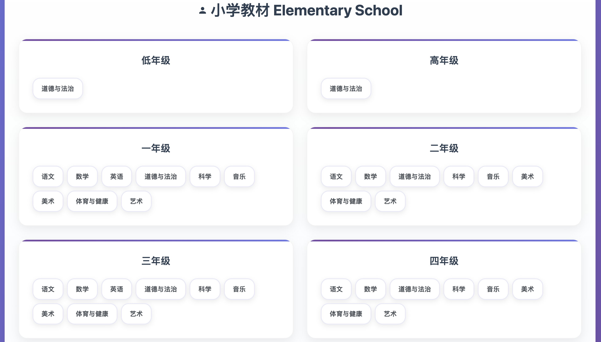

# 中国教材下载中心 | Chinese Textbook Download Center

[](https://github.com/rong2ren/chinese-textbook-downloader/stargazers)
[](https://github.com/rong2ren/chinese-textbook-downloader/network)
[](LICENSE)

> 🎓 中国教材下载系统，支持全球访问优化  
> Chinese textbook download system with global access optimization


## 📸 截图 | Screenshots

### 页面头部 | Header & Navigation


### 小学界面 | Elementary School Interface


### 大学界面 | University Level Interface


## ✨ 主要功能 | Key Features

### 🌍 智能下载系统 | Smart Download System
- **自动地区检测** | Automatic location detection
- **中国用户优化** | China-optimized with jsDelivr CDN + proxy fallback
- **国际用户支持** | International users with direct GitHub access

### 📚 完整教材库 | Complete Textbook Database
**数据来源 | Data Source**: [TapXWorld/ChinaTextbook](https://github.com/TapXWorld/ChinaTextbook) - 完整的中国教材收藏 | Complete Chinese textbook collection

- **2,371+ 本教材** | 2,371+ textbooks
- **6个教育阶段** | 6 education levels: 小学, 初中, 高中, 大学, etc.
- **27个学科** | 27 subjects: 数学, 语文, 英语, 科学, etc.
- **125+ 出版社** | 125+ publishers

## 🚀 快速开始 | Quick Start

### 在线访问 | Online Access
直接访问网站 | Visit directly: https://china-edu-books.vercel.app

### 本地运行 | Local Development
```bash
# 克隆仓库 | Clone repository
git clone https://github.com/rong2ren/chinese-textbook-downloader.git
cd chinese-textbook-downloader

# 启动本地服务器 | Start local server
python3 -m http.server 8000
# 或 | or: npx serve .

# 访问 | Access: http://localhost:8000
```

### 测试中国模式 | Test China Mode
```
http://localhost:8000/index.html?isChina=true
```

## 🔧 配置 | Configuration

### 代理配置 | Proxy Configuration
编辑 `fallback-proxy-config.js` | Edit `fallback-proxy-config.js`:
```javascript
window.FALLBACK_PROXY_CONFIG = {
    currentProxy: 'https://your-proxy-service.com/',
};
```

## 📊 统计数据 | Statistics

| 指标 Metric | 数值 Value |
|-------------|------------|
| 教材总数 Total Textbooks | 2,371+ |
| 教育阶段 Education Levels | 6 |
| 学科数量 Subjects | 27 |
| 出版社 Publishers | 125+ |
| jsDelivr成功率 Success Rate | 63.3% |
| 备用覆盖率 Fallback Coverage | 100% |

## 🙏 致谢 | Acknowledgments

- **TapXWorld/ChinaTextbook**: 原始教材数据库 | Original textbook database
- **jsDelivr**: 中国用户CDN服务 | CDN service for China users
- **GitHub**: 可靠的文件托管 | Reliable file hosting


本项目仅用于教育和研究目的。所有教材版权归各自出版社和作者所有。请支持正版出版物。

This project is for educational and research purposes only. All textbooks are property of their respective publishers and authors. Please support official publications.

---

<div align="center">
  <p>用❤️为中国教育而建 | Made with ❤️ for Chinese education</p>
</div> 
